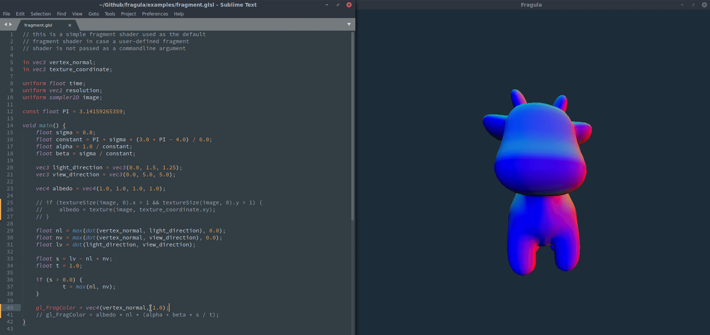

[](https://travis-ci.com/mandeep/fragula) [](https://crates.io/crates/fragula) [](https://crates.io/crates/fragula)

Fragula lets you view your fragment shader changes in real time. Simply save your fragment
shader while editing and watch your changes appear in the Fragula window in real-time.

Installation
============

To install Fragula run `cargo install fragula` in a terminal prompt.

Usage
=====
```
USAGE:
    fragula [OPTIONS] <obj> <shader>

FLAGS:
    -h, --help       Prints help information
    -V, --version    Prints version information

OPTIONS:
    -t, --texture <texture>    Texture image to load.

ARGS:
    <obj>       Obj file to load.
    <shader>    Fragment shader to load.
```

To use Fragula you can run `fragula` in a terminal with the path to the
OBJ file and fragment shader you would like to use:

    $  fragula my_3d_model.obj fragment.glsl

If you have an image texture that you would like to use in your
fragment shader you can use the `--texture` or `-t` flag:

    $  fragula my_3d_model.obj fragment.glsl -t my_image_texture.png

Demo
====

