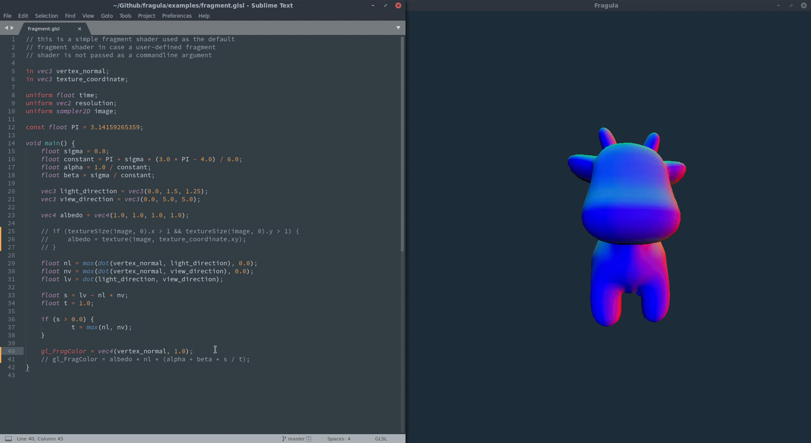

  

Fragula lets you view your fragment shader changes in real time. Simply save your fragment
shader while editing and watch your changes appear in the Fragula window in real-time.

Installation
============

To install Fragula run `cargo install fragula` in a terminal prompt.

Usage
=====

To use Fragula you can run `fragula` in a terminal with the path to the
OBJ file and fragment shader you would like to use:

    $  fragula my_3d_model.obj fragment.glsl

Demo
====

